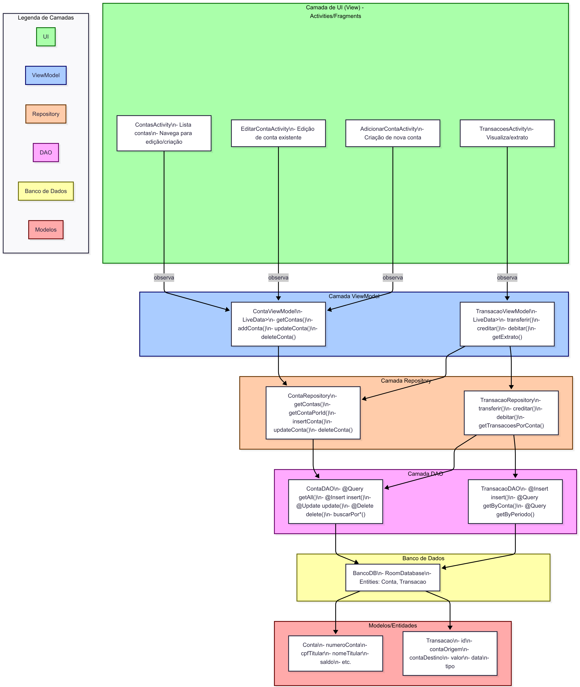
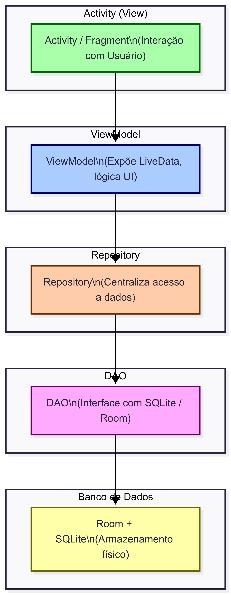

# Projeto Banco - Aplicativo de Gerenciamento de Contas

### Visão Geral do Projeto:

Este projeto é um aplicativo Android para gerenciamento de contas bancárias, utilizando arquitetura MVVM com Room para persistência local, LiveData para atualização reativa da UI, e ViewModel para separar lógica de negócios da interface.

## Passos do roteiro Aqui listo os passos do roteiro do professor que foram implementados. Estes 15 Passos cobrem os 20 passos da atividade:

Passos Completados

1. RecyclerView na ContasActivity integrado ao LiveData

O RecyclerView foi configurado para usar a lista de contas proveniente do ContaViewModel (com LiveData<List<Conta>>). Essa decisão garante atualização em tempo real sempre que houver modificações no banco de dados.

2. Atualização de imagem no ContaViewHolder

O ícone exibido em cada item da lista foi vinculado ao saldo da conta: se negativo, aparece um ícone de alerta; se positivo, um ícone de confirmação. Essa escolha facilita a identificação rápida da situação da conta.

3. Remoção de contas pelo ContaViewHolder

Foi incluído um botão de remoção diretamente no item da lista, que aciona o método correspondente no ContaViewModel. A remoção é imediata e refletida na tela.

4. Intent para EditarContaActivity com número da conta

Foi implementado o envio do número da conta pelo Intent ao abrir a EditarContaActivity. Dessa forma, a tela de edição consegue identificar e carregar a conta correta para atualização ou exclusão.

5. Validação ao adicionar conta

Na AdicionarContaActivity, foi implementada uma validação completa dos dados do formulário (campos obrigatórios e saldo numérico válido). Isso evita registros inconsistentes no banco.

6. Métodos de atualização e remoção no DAO

O ContaDAO recebeu os métodos @Update e @Delete, permitindo alterações e exclusões de registros de forma centralizada.

7. Consultas personalizadas no DAO

Foram criadas queries específicas para buscar contas por número, nome ou CPF, ampliando a flexibilidade das pesquisas.

8. Repository e ViewModel para operações e buscas

O ContaRepository e o ContaViewModel foram expandidos para dar suporte a atualização, remoção e buscas. As operações foram implementadas em background threads, seguindo boas práticas de Android.

9. Edição de contas

Na EditarContaActivity, o número da conta recebido pelo Intent é usado para buscar os dados no banco. Foi incluída validação de formulário e opções para atualizar ou remover a conta. Essa Activity garante consistência semelhante à tela de adição.

10. BancoViewModel com operações financeiras

O BancoViewModel concentra as operações de crédito, débito e transferência. Decidiu-se centralizar a lógica aqui para manter a separação entre regras de negócio e interface gráfica.

11. Validação nas operações de débito, crédito e transferência

Nas respectivas Activities, implementamos validações para confirmar existência das contas e valores positivos. Essa decisão evita operações inválidas ou inconsistentes.

12. Registro de transações após operações

Cada operação (débito, crédito e transferência) gera uma transação no banco. Na transferência, são registradas duas transações: uma de débito e outra de crédito. Isso garante rastreabilidade completa das movimentações.

13. Pesquisa de contas por diferentes critérios

Na PesquisarActivity, foi implementado um sistema de pesquisa que permite buscar por número, nome ou CPF, com atualização dinâmica do RecyclerView. A escolha de atualizar em tempo real melhora a experiência do usuário.

14. Valor total exibido na MainActivity

A tela principal exibe o valor total disponível no banco, calculado como soma dos saldos. Consideramos saldos negativos, fornecendo uma visão realista da situação geral.

15. Cores em transações de débito

No TransacaoViewHolder, os valores de transações de débito são destacados em vermelho, melhorando a clareza visual do histórico.

16. Consultas de transações

No TransacaoDAO, TransacaoRepository e TransacaoViewModel, foram criados métodos de busca por número da conta, por data e por tipo (crédito, débito ou todas). Isso oferece flexibilidade no histórico.

17. Tela de histórico de transações

A TransacoesActivity exibe todas as transações inicialmente e permite filtrar de acordo com o critério desejado. Essa escolha facilita o acompanhamento do movimento financeiro.

18. Integração entre BancoViewModel e TransacaoViewModel

As operações financeiras do BancoViewModel agora estão integradas ao TransacaoViewModel, garantindo que toda movimentação gere uma transação registrada automaticamente.

## Estrutura do projeto
**Camada UI:** ContasActivity, EditarContaActivity, AdicionarContaActivity, PesquisarActivity, TransacoesActivity e seus adapters/viewholders.

**ViewModel:** ContaViewModel, BancoViewModel, TransacaoViewModel.

**Repositórios:** ContaRepository, TransacaoRepository.

**DAO:** ContaDAO, TransacaoDAO.

**Banco:** Classe BancoDB com instância do Room.

## Arquitetura do App & Logica da Interação entre os componentes

| Estrutura do App                                 | Lógica de Interação |
|--------------------------------------------------|---------------------|
|  |  |

## Decisões de implementação
Arquitetura MVVM: Mantive o padrão para separar responsabilidades.

Uso de Room: O Room foi a escolha para persistência local.

Threads separadas: Todas operações de banco foram feitas em threads de background para evitar bloqueio da interface, usando @WorkerThread.

Passagem de parâmetros via Intent: Para manter a navegação fluida e o compartilhamento de dados entre telas, utilizei Intent.putExtra para o número da conta.

Atualização reativa da UI: O LiveData foi usado para observar as listas de contas e transações, fazendo com que o RecyclerView seja atualizado automaticamente sem necessidade de refresh manual.

Imagens condicionais: Usei lógica simples no ContaViewHolder para alterar a imagem do item de acordo com o saldo.

Filtros de busca na camada DAO: Preferi fazer as filtragens direto nas queries SQL para otimizar performance e reduzir processamento na camada UI.

Reuso e organização do código: Centralizei o acesso a dados no Repository, garantindo um ponto único para operações, facilitando manutenção e possíveis melhorias futuras.

Estilo UI : Utilizei as Cores do CIn para ficar com a interface semelhante a o estilo Acadêmico do Centro de Informática.

